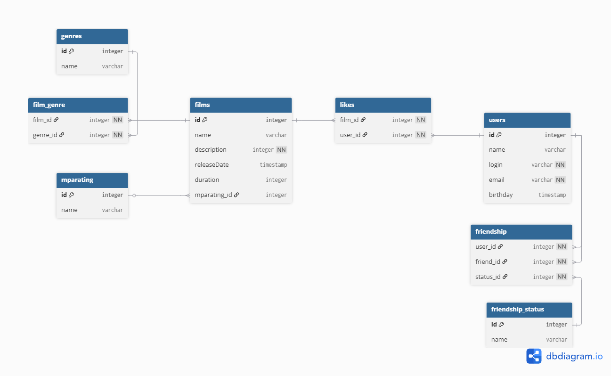

# java-filmorate
Template repository for Filmorate project.
##Er диаграмма БД


### Описание сущностей БД

Таблица `users` хранит данные пользователей

Таблица `films` хранит данные фильмов

Таблица `mparating` хранит список возможных рейтингов фильмов

Таблица `genres` хранит список возможных жанров фильмов

Таблица `film_genre` хранит отношение фильм-жанр, 
так как у каждого фильма может быть несколько жанров

Таблица `likes` хранит отношение фильм-пользователь(кто лайкнул)

Таблица `friendship` хранит отношение пользователь-друг-статус дружбы

Таблица `friendship_status` хранит описание статуса дружбы

#### Основные запросы
1. Получение фильма с выводом рэйтинга фильма
```
SELECT f.id,
       f.name,
       f.description,
       f.release_date,
       f.duration,
       m.name AS mparating
FROM films AS f
INNER JOIN mparating AS mr ON f.mparating_id = mr.id
WHERE f.id = 1;
```

2. Получение списка жанров по id фильма
```
SELECT DISTINCT g.name AS genres
FROM films AS f
INNER JOIN film_genre AS fg ON f.id = fg.film_id
INNER JOIN genres AS g on g.id = fg.genre_id
WHERE f.id = 1;
```
3. Получение количества лайков по id фильма
```
SELECT count(DISTINCT user_id) AS count_likes
FROM films AS f
INNER JOIN likes AS l ON f.id = fg.film_id
WHERE f.id = 1;
```
4. Получение данных по id пользователя
```
SELECT *
FROM users AS u
WHERE u.id = 1;
```
5. Получение списка друзей пользователя по id, со статусом дружбы
```
SELECT uf.login,
       uf.name,
       uf.email,
       uf.birthday,
       uf.name AS friendship_status
FROM users AS u
INNER JOIN friendship AS f on f.user_id = u.id
INNER JOIN friendship_status fs on fd.id = f.status_id
INNER JOIN users AS uf on f.friend_id = uf.id
WHERE u.id = 1;
```
